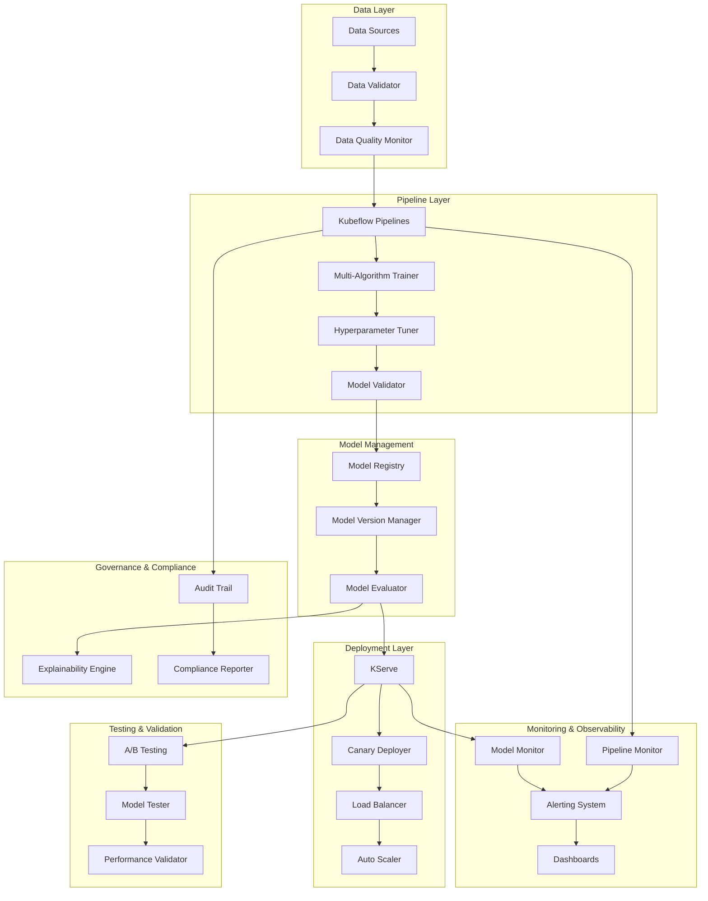

# Design Document

## Overview

The Enhanced MLOps Pipeline extends the existing Kubeflow pipeline with enterprise-grade features including automated model versioning, comprehensive monitoring, multi-algorithm support, automated KServe deployment, data validation, audit trails, resource optimization, and A/B testing capabilities. The design follows cloud-native principles and leverages Kubernetes ecosystem tools for scalability and reliability.

## Architecture

### High-Level Architecture



### Component Architecture

The system is built using a microservices architecture with the following key components:

1. **Enhanced Pipeline Controller**: Orchestrates the entire ML workflow
2. **Model Registry Service**: Manages model versions and metadata
3. **Monitoring Service**: Collects and analyzes pipeline and model metrics
4. **Deployment Service**: Handles automated KServe deployments
5. **Data Validation Service**: Ensures data quality and schema compliance
6. **A/B Testing Service**: Manages traffic splitting and experiment analysis

## Components and Interfaces

### 1. Enhanced Pipeline Controller

**Purpose**: Central orchestrator for the ML pipeline with advanced features

**Key Features**:
- Multi-algorithm training coordination
- Automated hyperparameter tuning
- Pipeline state management
- Resource optimization

**Interfaces**:
- REST API for pipeline management
- gRPC for internal service communication
- Kubernetes CRDs for pipeline definitions

**Implementation**:
```python
class EnhancedPipelineController:
    def __init__(self):
        self.model_registry = ModelRegistryClient()
        self.monitoring = MonitoringService()
        self.deployment = DeploymentService()
    
    async def execute_pipeline(self, config: PipelineConfig):
        # Validate data
        # Train multiple algorithms
        # Select best model
        # Register model version
        # Deploy to staging
        # Monitor performance
```

### 2. Model Registry Service

**Purpose**: Centralized model version management and metadata storage

**Key Features**:
- Semantic versioning
- Model lineage tracking
- Performance comparison
- Automated promotion rules

**Data Models**:
```python
@dataclass
class ModelVersion:
    id: str
    version: str
    algorithm: str
    hyperparameters: Dict
    metrics: Dict
    training_data_hash: str
    created_at: datetime
    status: ModelStatus
    artifacts_uri: str
```

**Storage**: 
- PostgreSQL for metadata
- S3/MinIO for model artifacts
- Redis for caching

### 3. Multi-Algorithm Training Engine

**Purpose**: Parallel training of multiple ML algorithms with comparison

**Supported Algorithms**:
- Logistic Regression
- Random Forest
- Support Vector Machine
- XGBoost
- Neural Networks (TensorFlow/PyTorch)

**Hyperparameter Optimization**:
- Grid Search
- Random Search
- Bayesian Optimization (Optuna)
- Hyperband

**Implementation Strategy**:
- Kubernetes Jobs for parallel training
- Shared storage for data access
- Resource quotas for fair scheduling

### 4. Monitoring and Observability

**Metrics Collection**:
- Pipeline execution metrics (Prometheus)
- Model performance metrics (custom collectors)
- Resource utilization (Kubernetes metrics)
- Data quality metrics (Great Expectations)

**Alerting**:
- Performance degradation alerts
- Data drift detection
- Pipeline failure notifications
- Resource threshold alerts

**Dashboards**:
- Grafana for operational metrics
- Custom React dashboard for ML-specific metrics
- Jupyter notebooks for ad-hoc analysis

### 5. Automated KServe Deployment

**Deployment Strategy**:
- Blue-Green deployments for major versions
- Canary deployments for minor updates
- Rolling updates for patches

**Traffic Management**:
- Istio for traffic splitting
- Envoy proxy for load balancing
- Circuit breakers for fault tolerance

**Auto-scaling**:
- Horizontal Pod Autoscaler (HPA)
- Vertical Pod Autoscaler (VPA)
- Custom metrics for ML-specific scaling

### 6. Data Validation and Quality

**Validation Framework**:
- Schema validation using JSON Schema
- Statistical validation using Great Expectations
- Data drift detection using Evidently AI

**Quality Metrics**:
- Completeness
- Consistency
- Accuracy
- Timeliness
- Validity

## Data Models

### Pipeline Configuration
```yaml
apiVersion: mlops.io/v1
kind: EnhancedPipeline
metadata:
  name: iris-classification-enhanced
spec:
  data:
    source: s3://data-bucket/iris/
    validation:
      schema: iris-schema.json
      quality_checks:
        - completeness > 0.95
        - uniqueness > 0.99
  algorithms:
    - name: logistic_regression
      hyperparameters:
        C: [0.1, 1.0, 10.0]
        solver: [liblinear, lbfgs]
    - name: random_forest
      hyperparameters:
        n_estimators: [100, 200, 500]
        max_depth: [5, 10, 15]
  deployment:
    strategy: canary
    traffic_split: 10
    success_criteria:
      accuracy: > 0.95
      latency: < 100ms
  monitoring:
    alerts:
      - metric: accuracy
        threshold: 0.9
        action: rollback
```

### Model Metadata Schema
```json
{
  "model_id": "uuid",
  "version": "semantic_version",
  "algorithm": "string",
  "hyperparameters": "object",
  "training_metrics": {
    "accuracy": "float",
    "precision": "float",
    "recall": "float",
    "f1_score": "float"
  },
  "validation_metrics": "object",
  "training_data": {
    "source": "string",
    "hash": "string",
    "size": "integer"
  },
  "artifacts": {
    "model_file": "string",
    "feature_importance": "string",
    "confusion_matrix": "string"
  },
  "deployment_history": "array",
  "audit_trail": "array"
}
```

## Error Handling

### Pipeline Failures
- Automatic retry with exponential backoff
- Dead letter queues for failed jobs
- Detailed error logging and alerting
- Graceful degradation strategies

### Model Deployment Failures
- Automatic rollback to previous version
- Health check validation
- Circuit breaker patterns
- Fallback to default model

### Data Quality Issues
- Data quarantine mechanisms
- Alternative data source fallbacks
- Manual intervention workflows
- Quality score thresholds

## Testing Strategy

### Unit Testing
- Individual component testing
- Mock external dependencies
- Property-based testing for algorithms
- Coverage targets: >90%

### Integration Testing
- End-to-end pipeline testing
- Service interaction testing
- Database integration testing
- API contract testing

### Performance Testing
- Load testing for inference endpoints
- Stress testing for training pipelines
- Scalability testing for concurrent users
- Resource utilization testing

### A/B Testing Framework
- Statistical significance calculation
- Multi-armed bandit algorithms
- Automated winner selection
- Experiment lifecycle management

### Model Validation Testing
- Cross-validation strategies
- Holdout dataset validation
- Temporal validation for time series
- Bias and fairness testing

## Security Considerations

### Authentication and Authorization
- RBAC for pipeline access
- Service-to-service authentication
- API key management
- Audit logging for access

### Data Security
- Encryption at rest and in transit
- PII detection and masking
- Data lineage tracking
- Compliance with GDPR/CCPA

### Model Security
- Model artifact signing
- Adversarial attack detection
- Input validation and sanitization
- Model watermarking

## Scalability and Performance

### Horizontal Scaling
- Kubernetes-native scaling
- Auto-scaling based on queue depth
- Resource pooling for training jobs
- Load balancing for inference

### Performance Optimization
- Model quantization and pruning
- Caching strategies
- Batch inference optimization
- GPU utilization optimization

### Resource Management
- Resource quotas and limits
- Priority classes for workloads
- Cost optimization strategies
- Multi-tenancy support